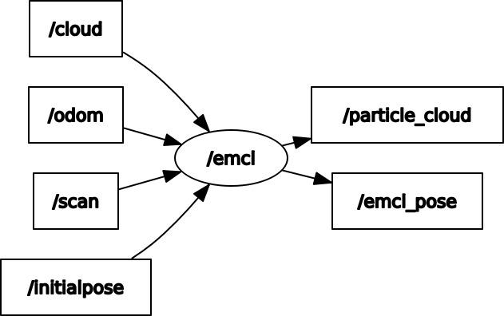

# emcl_ros


[](https://opensource.org/licenses/MIT)

ROS implementation of emcl (mcl with expansion resetting)

<p align="center">
  
  
</p>
<p align="center">
  
  
</p>

## Environment
- Ubuntu 20.04
- ROS Noetic

## Install and Build
```
# clone repository
cd /path/to/your/catkin_ws/src
git clone https://github.com/ToshikiNakamura0412/emcl_ros.git

# build
cd /path/to/your/catkin_ws
rosdep install -riy --from-paths src --rosdistro noetic # Install dependencies
catkin build emcl_ros -DCMAKE_BUILD_TYPE=Release        # Release build is recommended
```

## How to use
```
roslaunch emcl_ros emcl_ros.launch
```

## Running the demo
```
# clone repository
cd /path/to/your/catkin_ws/src
git clone https://github.com/ToshikiNakamura0412/scan_to_pcl_ros.git
git clone -b noetic-devel https://github.com/ROBOTIS-GIT/turtlebot3_msgs.git
git clone -b noetic-devel https://github.com/ROBOTIS-GIT/turtlebot3.git
git clone -b noetic-devel https://github.com/ROBOTIS-GIT/turtlebot3_simulations.git

# build
cd /path/to/your/catkin_ws
rosdep install -riy --from-paths src --rosdistro noetic
catkin build -DCMAKE_BUILD_TYPE=Release

# run demo
## terminal 1
export TURTLEBOT3_MODEL=burger
roslaunch emcl_ros test.launch
## terminal 2
export TURTLEBOT3_MODEL=burger
roslaunch turtlebot3_teleop turtlebot3_teleop_key.launch
```

## Node I/O


## Nodes
### emcl
#### Published Topics
- /emcl_pose (`geometry_msgs/PoseWithCovarianceStamped`)
  - The estimated pose of the robot
- /tf (`tf2_msgs/TFMessage`)
  - The tf of the robot
- ~\<name>/particle_cloud (`geometry_msgs/PoseArray`)
  - The particle cloud of mcl

#### Subscribed Topics
- /cloud (`sensor_msgs/PointCloud2`)
  - The input pointcloud data
  - If ~\<name>/use_cloud is false, this topic is not used
- /initialpose (`geometry_msgs/PoseWithCovarianceStamped`)
  - The initial pose of the robot
- /odom (`nav_msgs/Odometry`)
  - The odometry data
- /scan (`sensor_msgs/LaserScan`)
  - The input laser scan data (default)


#### Parameters
##### EMCL Parameters
- ~\<name>/<b>expansion_position_dev</b> (float: `0.07` [m]):<br>
  The standard deviation of the expansion noise in position
- ~\<name>/<b>expansion_orientation_dev</b> (float, default: `0.15` [rad]):<br>
  The standard deviation of the expansion noise in orientation
- ~\<name>/<b>init_x</b> (float, default: `0.0` [m]):<br>
  The initial x position of the robot
- ~\<name>/<b>init_y</b> (float, default: `0.0` [m]):<br>
  The initial y position of the robot
- ~\<name>/<b>init_yaw</b> (float, default: `0.0` [rad]):<br>
  The initial yaw of the robot
- ~\<name>/<b>init_position_dev</b> (float, default: `0.1` [m]):<br>
  The standard deviation of the initial noise in position
- ~\<name>/<b>init_orientation_dev</b> (float, default: `0.05` [rad]):<br>
  The standard deviation of the initial noise in orientation
- ~\<name>/<b>laser_step</b> (int, default: `4`):<br>
  The step of the laser scan
- ~\<name>/<b>likelihood_th</b> (float, default: `0.002`):<br>
  The threshold of the likelihood
- ~\<name>/<b>particle_num</b> (int, default: `420`):<br>
  The number of particles
- ~\<name>/<b>reset_count_limit</b> (int, default: `3`):<br>
  The limit of the reset count
- ~\<name>/<b>sensor_noise_ratio</b> (float, default: `0.02`):<br>
  The ratio of sensor noise to the actual sensor noise
- ~\<name>/<b>use_cloud</b> (bool, default: `False`):<br>
  If true, use pointcloud instead of laser scan

##### OdomModel Parameters
- ~\<name>/<b>ff</b> (float, default: `0.17` [m]):<br>
  Standard deviation of forward noise per forward
- ~\<name>/<b>fr</b> (float, default: `0.0005` [m]):<br>
  Standard deviation of forward noise per rotation
- ~\<name>/<b>rf</b> (float, default: `0.13` [rad]):<br>
  Standard deviation of rotation noise per forward
- ~\<name>/<b>rr</b> (float, default: `0.2` [rad]):<br>
  Standard deviation of rotation noise per rotation

##### Scan Parameters
If pointcloud is used, following parameters are used.

- ~\<name>/<b>range_min</b> (float, default: `0.12` [m]):<br>
  The minimum range of the sensor
- ~\<name>/<b>range_max</b> (float, default: `3.5` [m]):<br>
  The maximum range of the sensor

## References
- 上田隆一, "詳解 確率ロボティクス Pythonによる基礎アルゴリズムの実装", Kodansya, 2019
- https://github.com/ryuichiueda/emcl
- 赤井直紀, "LiDARを用いた高度自己位置推定システム - 移動ロボットのための自己位置推定の高性能化とその実装例", コロナ社, 2022
- https://github.com/NaokiAkai/ALSEdu
